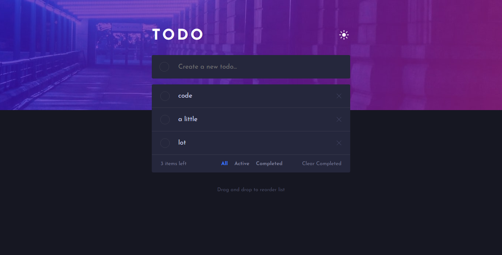

# Frontend Mentor - Todo app solution

This is a solution to the [Todo app challenge on Frontend Mentor](https://www.frontendmentor.io/challenges/todo-app-Su1_KokOW). Frontend Mentor challenges help you improve your coding skills by building realistic projects. 

## Table of contents

- [Overview](#overview)
  - [The challenge](#the-challenge)
  - [Screenshot](#screenshot)
  - [Links](#links)
- [My process](#my-process)
  - [Built with](#built-with)
  - [What I learned](#what-i-learned)
  - [Continued development](#continued-development)
  - [Useful resources](#useful-resources)
- [Author](#author)
- [Acknowledgments](#acknowledgments)

### The challenge

Users should be able to:

- View the optimal layout for the site depending on their device's screen size
- See hover states for all interactive elements on the page

### Screenshot

### Built with

- Semantic HTML5 markup
- CSS custom properties
- FlexBox
- Sass preprocessor
- React
- Gulp for SCSS pre-processing

### What I learned

I learned in this challenge the importance of well managed states in React. I wanted to use some reactContext but I thought that I could just use state itself and the local storage, since it is much better right. I also learned some other hooks to which I want to use in other projects. I also implemented my own drag and drop  :>>

### Continued development

I want to practice more about React!!